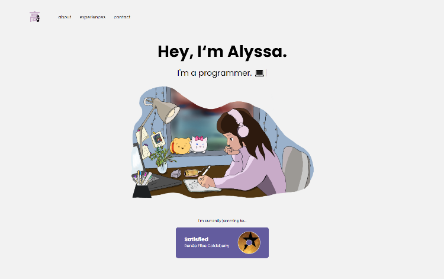

# Portfolio
[Check it out!](https://alyssagao.me/home)

This is my personal website (version 2). It is much more minimalistic and utilizes the Angular Framework.

This project was generated with [Angular CLI](https://github.com/angular/angular-cli) version 12.2.7.

 
